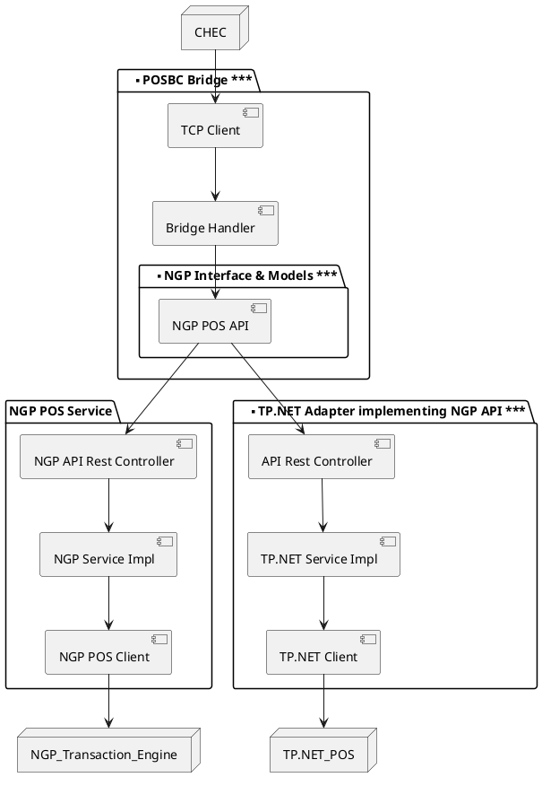

# Summary

# POSBC Bridge

POSBC Bridge is a Java application that will run on the lane alongside CHEC, allowing the Self Checkout Lane to interact with a modern POS exposing a REST API.

POSBC Bridge will implement a NGP POS client, allowing it to natively interact with NGP Transaction Engine through the exposed API.





# Developer Guide

### Build
`mvn clean install`

### Build (no unit tests)
`mvn clean install -DskipTests`

## Test

```
TODO
```
