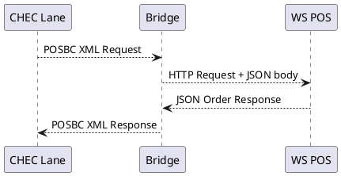
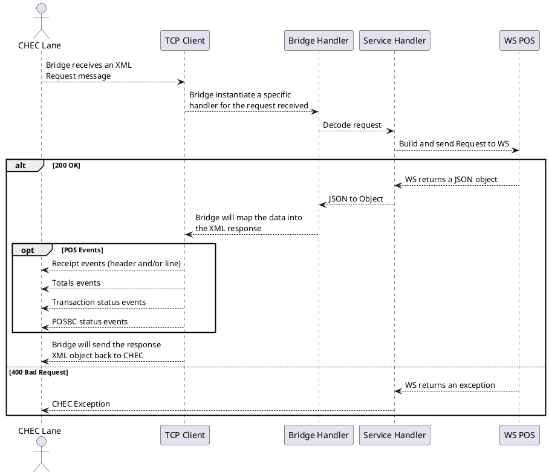

# POSBC Bridge Application Overview

# Table of contents
- [Table of contents](#table-of-contents)
- [Introduction](#introduction)
- [Business Goals](#business-goals)
- [Architecture Goals](#architecture-goals)
- [Overview](#overview)
- [Add Item Example](#additem-flow-example)

# Introduction

POSBC Bridge is a Java application created to connect standard CHEC lanes with modern WebService POSes

# Business Goals

    Use POSBC Bridge to leverage CHEC with WebService POS
    Reuse POSBC Bridge infrastructure on different POS platforms
    Allow CHEC to be a viable product in Europe
    Allow the reuse of the same patterns for a different POS solution
        change the webservice handler but maintain the CHEC handler implementation
    
# Architecture Goals

    CHEC should not have to change to meet initial interface goals
    POSBC Bridge should easily handle the interface between POS and CHEC
    Allow easy and quick development, without writing a specific POSBC layer for NGP
    Should have no dependencies on either CHEC or POS
    Mapping between data points between systems should be accomplished without a code release of CHEC or NGP.
    Should be flexible and easily maintainable
    Should be extendable, with low code possibilities
    
    
# Bridge Overview

# AddItem flow example

