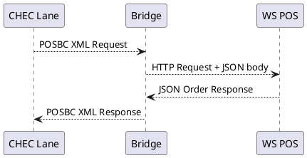
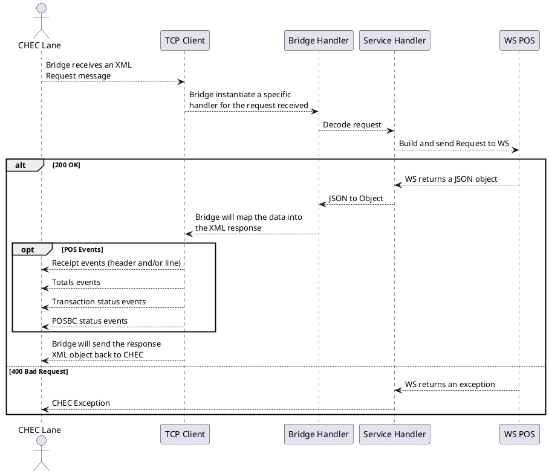

# POSBC Bridge Application Overview

# Table of contents
- [Table of contents](#table-of-contents)
- [Introduction](#introduction)
- [Overview](#overview)
- [Add Item Example](#additem-flow-example)

# Introduction

POSBC Bridge is a Java application created to connect standard CHEC lanes with modern WebService POSes

# Bridge Overview

# AddItem flow example

